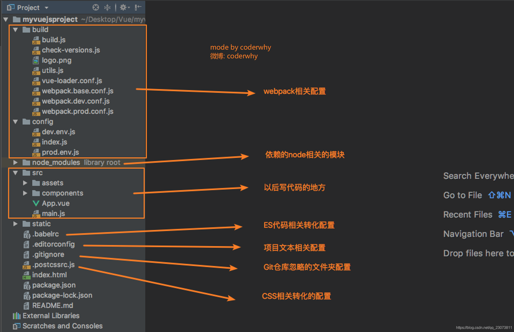
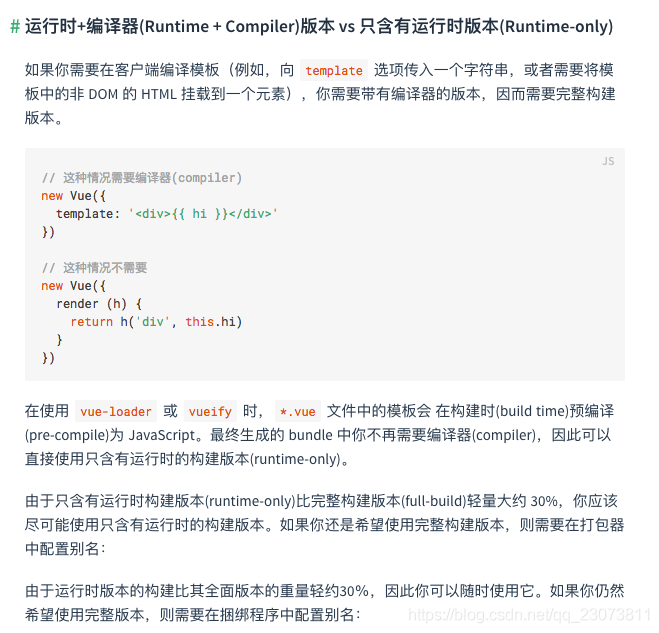
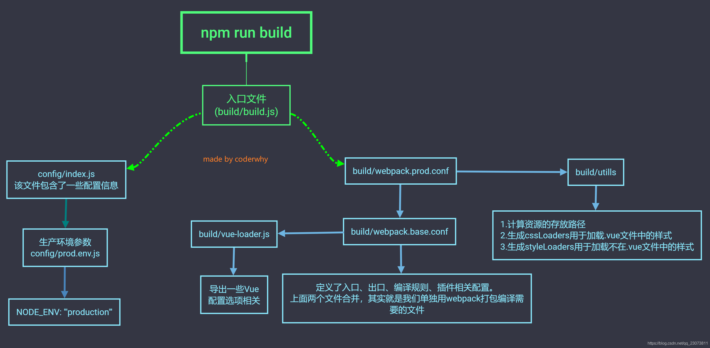
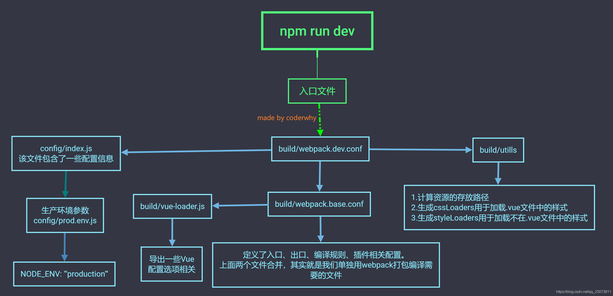

# Vue-cli使用详解

## 引言
  > Vue-cli是一个基于Vue.js进行快速开发的完整系统。Vue-cli致力于将vue生态中的工具基础**标准化**。他确保了各种构建工具能够基于智能的**默认配置**即可平稳衔接，这样你可以专注于撰写应用上，而不必花好几天去纠结配置的问题
  * CLI的全拼是command-line-interface，命令行界面，俗称脚手架
  * 它是一个专门为单页面应用快速搭建繁杂的脚手架，可以轻松的创建新的应用程序，而且可用于自动生成VUE和webpack的项目模板
  * 如果开发大型项目，我们必然需要使用Vue cli
  * Vue CLI为我们提供了清晰的代码目录结构, 项目结构、部署， 热加载，单元测试等功能。可以提高开发者的工作效率。

## Vue CLI依赖的环境
* 依赖**nodejs**和**npm**
  * 但是国内npm有时候很慢 ，可以安装cnpm镜像
  > `npm install -g cnpm --registry=https://registry.npm.taobao.org`
* 依赖webpack
  > Vue.js官方脚手架工具使用了webpack模板， 对所有资源进行了压缩优化，在开发过程中提供了一套完整的功能， 提高开发效率

## Vue CLI脚手架安装
1. 安装nodejs
2. 安装全局webpack
3. 安装局部webpack
4. 安装VUE CLI脚手架<br>
  `cnpm install -g @vue/cli@3.12.1`
5. 拉取2.x模板（旧版本）
   > Vue CLI >= 3 和旧版使用了相同的 vue 命令，所以 Vue CLI 2 (vue-cli) 被覆盖了。如果仍然需要使用旧版本的 vue init 功能，可以全局安装一个桥接工具。<br>
   `cnpm install -g @vue/cli-init`
6. 初始化项目<br>
   `vue init webpack my-project`
## Vue-CLI项目
### 初始化项目过程
1. `vue init webpack 项目名称` //vue2创建<br>
   `vue create 项目名称`   //vue3创建
2. ```
   ? Project name *** //项目名称
   ? Project description *** //作者信息
   ? Author ***              //作者信息 .gitconfig中存储了
   ? Vue build ***    //构建方式
   ? Install vue-router  //no,后面自己建
   ? Use Eslint to lint your code?//no 检查代码规范
   ? Set up unit tests //no 单元测试
   ? Setup e2e tests with nightwatch? //no ,end to end 测试，nightwatch是一个自动化测试的框架
   ? should ····？//npm 
   ```
3. 目录结构详解



## Runtime-Compiler和Runtime-only的区别
* 

* **对比程序运行过程**
  > ***Runtime-Compiler执行过程***:<br>template -> ast ->render ->virtual dom ->UI

  > ***Runtime-only执行过程***:<br>render -> virtual dom ->UI，Runtime-only代码量更少，性能更加高效！！！
* **总结**
> 如果在之后的开发中，你依然使用template，就需要选择Runtime-Compiler。如果之后的开发中，使用的是.vue文件夹开发，那么可以选择Runtime-only。
## render函数的使用
**Runtime-Compiler**
  ```
  new Vue({
    el:'#app',
    render:function(createElement){
      //方式 1.createElement('标签'，{标签的属性}，['数组'])
      // return createElement('h3',{class:'st1'},['hello Vue.js!!!'])

      // 方式2.传入组件对象
      // return createElement(cpn)

      return createElement(App)
    }
  })
  ```
  **Runtime-Only**
  ```
  new Vue({
    el:'#app',
    render:h=>(App)//h是createElement函数的别名
  })
  //另一种
  new Vue({
    render:h=>(App)
  }).$mount('#app')
  ```
  ## Vue-CLI2运行指令
  1. **npm run build**
  
  2. **npm run dev**
  

  ## Vue-CLI3
  ### 1. 认识Vue-CLI3
  > **vue-cli 3 与 2 版本有很大区别**
  1. vue-cli 3 是基于 webpack 4 打造，vue-cli 2 还是 webapck 3
  2. vue-cli 3 的设计原则是“0配置”，移除的配置文件根目录下的，build和config等目录
  3. vue-cli 3 提供了 vue ui 命令，提供了可视化配置，更加人性化
  4. 移除了static文件夹，新增了public文件夹，并且index.html移动到public中 
