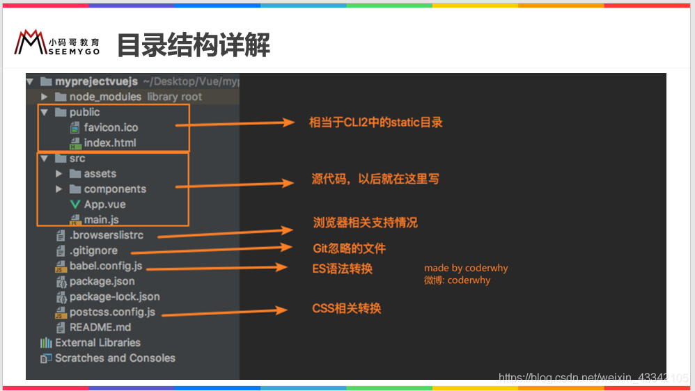
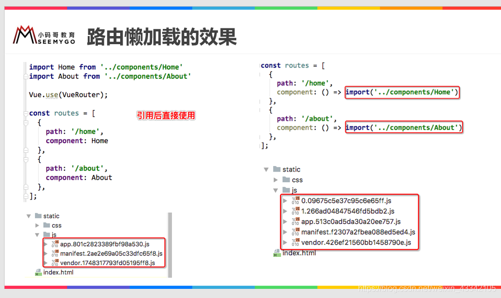

# Vue-cli使用详解

## 引言
  > Vue-cli是一个基于Vue.js进行快速开发的完整系统。Vue-cli致力于将vue生态中的工具基础**标准化**。他确保了各种构建工具能够基于智能的**默认配置**即可平稳衔接，这样你可以专注于撰写应用上，而不必花好几天去纠结配置的问题
  * CLI的全拼是command-line-interface，命令行界面，俗称脚手架
  * 它是一个专门为单页面应用快速搭建繁杂的脚手架，可以轻松的创建新的应用程序，而且可用于自动生成VUE和webpack的项目模板
  * 如果开发大型项目，我们必然需要使用Vue cli
  * Vue CLI为我们提供了清晰的代码目录结构, 项目结构、部署， 热加载，单元测试等功能。可以提高开发者的工作效率。

## Vue CLI依赖的环境
* 依赖**nodejs**和**npm**
  * 但是国内npm有时候很慢 ，可以安装cnpm镜像
  > `npm install -g cnpm --registry=https://registry.npm.taobao.org`
* 依赖webpack
  > Vue.js官方脚手架工具使用了webpack模板， 对所有资源进行了压缩优化，在开发过程中提供了一套完整的功能， 提高开发效率

## Vue CLI脚手架安装
1. 安装nodejs
2. 安装全局webpack
3. 安装局部webpack
4. 安装VUE CLI脚手架<br>
  `cnpm install -g @vue/cli@3.12.1`
5. 拉取2.x模板（旧版本）
   > Vue CLI >= 3 和旧版使用了相同的 vue 命令，所以 Vue CLI 2 (vue-cli) 被覆盖了。如果仍然需要使用旧版本的 vue init 功能，可以全局安装一个桥接工具。<br>
   `cnpm install -g @vue/cli-init`
6. 初始化项目<br>
   `vue init webpack my-project`
## Vue-CLI项目
### 初始化项目过程
1. `vue init webpack 项目名称` //vue2创建<br>
   `vue create 项目名称`   //vue3创建
2. ```
   ? Project name *** //项目名称
   ? Project description *** //作者信息
   ? Author ***              //作者信息 .gitconfig中存储了
   ? Vue build ***    //构建方式
   ? Install vue-router  //no,后面自己建
   ? Use Eslint to lint your code?//no 检查代码规范
   ? Set up unit tests //no 单元测试
   ? Setup e2e tests with nightwatch? //no ,end to end 测试，nightwatch是一个自动化测试的框架
   ? should ····？//npm 
   ```
3. 目录结构详解


## Runtime-Compiler和Runtime-only的区别
* 

* **对比程序运行过程**
  > ***Runtime-Compiler执行过程***:<br>template -> ast ->render ->virtual dom ->UI

  > ***Runtime-only执行过程***:<br>render -> virtual dom ->UI，Runtime-only代码量更少，性能更加高效！！！
* **总结**
> 如果在之后的开发中，你依然使用template，就需要选择Runtime-Compiler。如果之后的开发中，使用的是.vue文件夹开发，那么可以选择Runtime-only。
## render函数的使用
**Runtime-Compiler**
  ```
  new Vue({
    el:'#app',
    render:function(createElement){
      //方式 1.createElement('标签'，{标签的属性}，['数组'])
      // return createElement('h3',{class:'st1'},['hello Vue.js!!!'])

      // 方式2.传入组件对象
      // return createElement(cpn)

      return createElement(App)
    }
  })
  ```
  **Runtime-Only**
  ```
  new Vue({
    el:'#app',
    render:h=>(App)//h是createElement函数的别名
  })
  //另一种
  new Vue({
    render:h=>(App)
  }).$mount('#app')
  ```
  ## Vue-CLI2运行指令
  1. **npm run build**
  
  2. **npm run dev**
  

  ## Vue-CLI3
  ### 1. 认识Vue-CLI3
  > **vue-cli 3 与 2 版本有很大区别**
  1. vue-cli 3 是基于 webpack 4 打造，vue-cli 2 还是 webapck 3
  2. vue-cli 3 的设计原则是“0配置”，移除的配置文件根目录下的，build和config等目录
  3. vue-cli 3 提供了 vue ui 命令，提供了可视化配置，更加人性化
  4. 移除了static文件夹，新增了public文件夹，并且index.html移动到public中 
  ### 2. 使用Vue-CLI3
  1. 创建<br>
  `vue create 项目名称`
  2. 创建过程

      ```
      ?Please pick a preset://选择一个配置 Manually     select feature: 手动选择特->Manually select     feature: 手动选择特性
      ?Where do you prefer placing config forBabel,     ESLint, etc.? (Use arrow keys): // 置文件放在   那里呢? //选择独立文件
      ?Save this as a preset for future projects?(y/    N) //是否将刚刚的配置保存到项目中? 是。样以后搭   建项目就可以选这个配置
      Save preset as: //保存上面的配置的文件名是 么?
      ```

      > 如果我们设置了很多自定义配置,如何取消呢?<br>
      在/Users/用户名/.vuerc, 修改这个文件.里面有个选项是presets. 下面就是我们保存的设置.

  3. 目录结构
    

  ### 配置文件管理
  1. 法一：使用vue UI配置界面修改
     * 安装vue UI界面管理<br> `vue ui`
  2. 法二：在node_module模块中查看配置
     + node_module->@vue->cli-service->**webpack.config.js**

  3. 法三：自定义需要修改的配置文件
      > 在根目录下新建一个文件vue.config.js. 这个文件名是固定的, 不可修改.
      ```
      module.exports= {
        //将自定义的内容写到module.exports里面
      }
      ```

## 路由

### 前端路由的规则
1. URL的hash
    * URL的hash也就是锚点(#), 本质上是改变window.location的href属性.
    * 我们可以通过直接赋值location.hash来改变href, 但是页面不发生刷新 
2. HTML5的history模式：pushState
     ```
     //可返回
     history.pushState({},'','/foo')
     ```
3. HTML5的history模式：replaceState
     ```
     //不可返回
     history.replaceState({},'','/foo')
     ```
4. HTML5的history模式：go
     ```
     history.go(-1) //返回上一界面
     history.go(1)  //返回下一界面
     ```
5. 补充
     > 上面只演示了三个方法<br>
      因为 history.back() 等价于 history.go(-1)<br>
      history.forward() 则等价于 history.go(1)<br>
      这三个接口等同于浏览器界面的前进后退。 

### vue-router基础

#### 一、安装和使用vue-router 
1. 安装vue-router<br>
     `npm install vue-router --save`（注意：要保证版本匹配）
2. 使用
     > 由于本质上是一个插件，所以可以直接用Vue.use()来安装路由功能
     1. 导入并调用<br>
     src-router-index.js（自己创建的路径
        ```
        import Vue from 'vue
        import VueRouter from 'vue-router'

        Vue.use(VueRouter)//注入插件
        ```
     2. 创建路由实例，并且传入路由映射配置<br>
     src-router-index.js
        ```
        const routes = [];//定义路由
        const router = new VueRouter({//创建router实例
          routes
        })
        export default router //导出router实例
        ```
     3. 在Vue实例中挂载创建的路由实例<br>
        main.js
        ```
        import router from './router'
        new Vue({
          el:'#app',
          router,   //
          render:h=>h(App)
        })
        ```

3. 使用vue-router的步骤
   1. 创建路由组件
      * src->components
      * 创建一个about.vue和一个home.vue
   2. 配置路由映射。组件和路由的映射关系<br>
      index.js
      ```
      import Home from '../components/home'
      import about from '../components/about'
      ···
      const routes = [
        {
          path:'./home',
          components:home
        },
        {
          path:'./about',
          components:About
        }
      ]
      ```
   3. 使用路由：(App.vue)通过`<router-link>`和`<router-view>`
      * `<router-link>`:该标签是一个vue-router中已经内置的组件，它会被渲染成一个`<a>`标签
      * `<router-view>`:该标签会根据当前的路径，动态渲染出不同的组件。
          * 网页的其他内容，比如顶部的标题导航，或者底部的一些版权信息等会和`<router-view>`同一个等级
          * 在路由切换时，切换的是`<router-view>`挂载的组件，其他内容不会发生改变

4. 其他
   1. 路由的默认路径<br>
      不要删除原有的home路径，这个只是重定向
      ```
      {
        path:'/',
        redirect:'/home'
      }
      ```
   2. HTML5的history模式<br>
      **我们之前都是采用hash的方式来静态路由跳转的， 但hash方式有一个缺点， 即带有#**
      ```
      const router = new VueRouter({
        routes,
        mode:'history' //****
      })
      ```
   3. router-link补充属性
      * **to** : 指定跳转路径
      * **tag**: tag可以指定`<router-link>`之后渲染成什么组件, 比如上面的代码会被渲染成一个`<li>`元素, 而不是`<a>`
      * **replace** : 没有值。replace不会留下history记录, 所以指定replace的情况下, 后退键返回不能返回到上一个页面中
      * **active-class** : 当<router-link>对应的路由匹配成功时, 会自动给当前元素设置一个**router-link-active**的class, 设置active-class可以修改默认的名称.
        * 在进行高亮显示的导航菜单或者底部tabbar时, 会使用到该类.
        * 但是通常不会修改类的属性, 会直接使用默认的router-link-active即可.
        * 该class具体的名称也可以通过router实例的属性进行修改
        ```
        router-index.js-router实例
        LinkActiveClass:'active'
        ```
   4. 路由代码跳转<br>
      app.vue
      ```
      <template>
        <div>
          <button @click="btnroute">首页</button>
          <router-view></router-view>
        </div>
      </template>
      ```
      ```
      <script>
        export default {
          name:'App',
          methods:{
            btnroute(){
              this.$router.push('./home')
            }
          }
        }
      </script>
      ```
   5.动态路由<br>
     地址后缀使用动态的获取,使user页面的路由后面跟上id
    * 创建user.vue
    * index.js
      ```
      {
        path:'/user/:id',
        component:User
      }
      ```
    * app.vue
      ```
      template
      <router-link :to="'/user/'+userId">User页面</router-link>
      ```
      ```
      script
      data(){
        userId:'XXXX'
      }
      ```
    * 另外 user.vue
      ```
      template
      {{$route.params.id}} 可以获取到userId,script中要加this
      ```
### 路由的懒加载
> 路由懒加载做了什么?<br>
路由懒加载的主要作用就是将路由对应的组件打包成一个个的js代码块.**只有在这个路由被访问到**的时候, 才加载对应的组件
  
  * app:当前应用程序开发的所有业务代码
  * manifest:为打包的代码做底层支撑
  * vendor:第三方插件？

> 懒加载的方式
  ```
  const Home = () => import('../components/home')
  ```
  > 我们将代码的引入方式改变了,这样在打包的时候, 会将每一个import进来的文件打包成一个单独的js文件. 如下图所示:
### 路由的嵌套
1. 创建子组件
2. 在index.js中创建组件路由
    ```
    //引入子路由-使用懒加载的方式进行加载
    const HomeBanner = ()=>import('../components/HomeBanner');
    const HomeNews = () => import('../components/HomeNews');

    {
      path: "/home",
      component: Home,
      children: [{
        path:'',
        redirect: 'HomeNew'
      },{
        path: 'HomeNew', //注意: 这里面没有/
        component: HomeNews
      },{
        path: 'HomeBanner',
        component: HomeBanner
      }]
    }

    ```
3. 增加routerlink和routerview
   * 注意：在routerlink中路径要写全
## vue参数传递
#### 1.param方式
   * 把app.vue中的userid数据传到子组件
      ```
      <router-link v-bind:to="'/user/'+userid">user组件</router-link>
      ```
   * index.js创建路由的时候定义变量
      ```
      {
        path:'/user/:id',
        component:
      }
      ```
   * user.vue使用变量
      ```
      template:
      //没有this！！
      //是route不是router!!
      //router:是我们index.js创建的那个大的路由对象router
      //route:当前哪个路由处于活跃状态，获取到的就是哪个路由
      //params有s!!
      {{$route.params.id}}   
      ```
      ```
      script
      data(){
        return {
           userid:this.$route.params.userid
        }
      }
      ```
#### 2. query方式
注意：
   * 配置路由的时候是普通配置
   * 传递的方式是用query的方式，query是一个对象
1. 创建一个profile组件
2. 配置路由（普通配置
3. 渲染组件
    ```
    <router-link :to="{
      path:'/profile',
      query:{name:'lily',age:18}
    }">档案</router-link>
    ```
4. 获取参数
   1. 直接语法糖方式：{{$route.params.XXX}}
   2. 在脚本中获取：this.$route.params.XXX
## 导航守卫
> 在vue中, 只有一个index.html页面,如何实现title的改变呢?<br>
> **有两种方法:**
> * 第一种, 使用生命周期函数created().
> * 第二种: 使用全局导航守卫
### 一、 使用生命周期函数实现页面更新title属性
在组件内部
```
<script>
    export default {
        name: "Home",
      created() {
          document.title="首页"
      }
    }
</script>
```
> 这样有什么问题? 假如现在有100个页面, 我们需要在100个页面中都增加created()函数. 虽然可以实现功能,但似乎有些麻烦, 有没有可以统一修改的办法呢?我们可以使用全局导航守卫实现
### 二、 使用全局导航守卫的方式更新title属性

#### 1. 在路由index.js增加元数据属性，并设置title属性值
```
{
  path:'/home',
  component:Home,
  meta:{
    title:"首页"
  }
}
```
#### 2. 在全局路由中设置title属性
```
router.beforeEach((to,from,next)=>{
  document.title = to.macth[0].meta.title;
  next()
})
```
#### 3. 其他守卫
  * 全局守卫app.vue
    * beforeEach、afterEach
  * 路由独享的守卫 index.js
    * beforeEnter
  * 组件内的守卫 XXX.vue
    * beforeRouterEnter
    * beforeRouterUpdate
    * beforeRouterLeave
## keep-alive
> 我们有首页, 关于, 用户, 档案. 首页下面有两个按钮[新闻],[消息]<br>当点击首页的[消息], 然后切换到关于页面, 再回到首页的时候, 我们希望能够继续展示[消息]的内容
<br>默认是不会保留操作的记忆的. 下次回来直接到[首页->新闻], 使用keep-alive就可以有保留记忆的效果了

> 在某一组件内创建created()和destroyed()函数，可以验证每次进入和离开都会创建和销毁组件

#### 如何才能让组件有记忆,而不是每次都重新创建呢？
```
在组件展示的位置
<keep-alive>
  <router-view></router-view>
</keep-alive>
```
我们看到只有第一次创建了home组件, 后来路由调走, 组件并没有被销毁.
#### 案例：实现从home-message跳走后，回来还是message的位置
> 我们可以**让路由调走之前记住当前组件的路由**. 要想实现这个功能,需要了解一下几个钩子函数:<br>这两个函数生效的条件是 : 设置了`<keep-alive>`组件才有效. 也就是说, 组件离开时不销毁.
  * activated: 路由激活时触发
  * deactivated: 路由取消激活时触发
* 在home组件增加两个方法, 一个是activated组件激活的时候重定向路由, 另一个是beforeRouteLeave组件离开前记录离开前的路由
  ```
  activated() {
    // 路由激活, 路由到path路径
    this.$router.push(this.path)
  },
  beforeRouteLeave(to, from, next) {
    console.log("离开home前的路径 "+this.path)
    this.path = this.$route.path;
    next()
  }
  ```

#### keep-alive属性
keep-alive有两个属性: 一个是include, 另一个是exclude
  * include: 字符串或者正则表达式, 只有匹配的组件才会被缓存
  * exclude: 字符串或者正则表达式, 匹配到的组件不会被缓存.
  ```
  <keep-alive exclude="Profile">
    <router-view></router-view>
  </keep-alive>
  ```
  这样, Profile组件就不会被缓存了