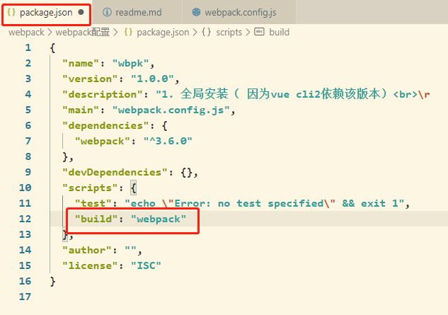

# webpack配置
## 安装和下载
1. 全局安装（ 因为vue cli2依赖该版本）<br>
     ``` npm install webpack@3.6.0 -g```
   
2. 局部安装(--save-dev是开发时依赖)<br>
   ` npm install webpack@3.6.0 --save-dev `
3. 为什么全局安装后，还需要局部安装呢？<br>
> 全局的指的是电脑上安装的webpack包, 所有项目都可以使用
全局打包`npm run webpack`
局部打包`npm run build`
本地webpack是指当前项目的webpack包. 通常全局webpack版本会比较高, 而我的项目是老项目, 使用的是老版本的
webpack打包的, 这时如果使用全局的webpack打包就会报错, 所以, 需要安装一个和项目匹配的本地的webpack包
## 文件目录
> webpack<br>
> |--dist<br>
> &emsp;&emsp;|--bundle.js(webpack可自动生成)<br>
> |--src<br>
> &emsp;&emsp;|--main.js<br>
> |--index.html<br>
> |--package.json
## webpack 的基本使用
### commonjs
> main.js<br>

```
function add(num1, num2) {
    return num1 + num2
}

function sub(num1, num2) {
    return num1 - num2
}

// 使用commonJs导出模块
module.exports={add, sub}
 ```
## webpack配置文件
**1. 如何使用webpack命令直接打包**<br>
> 刚刚我们打包的时候, 使用的是<br>
`webpack ./src/main.js ./dist/bundle.js`<br>
那么, 如果在项目下, 可不可以直接使用webpack, 而不用每次都指定文件呢? 这样可以方便很多
当然是可以的, 我们需要在项目根目录下创建一个文件: **webpack.config.js** *(这个名字是固定的)*

**2. webpack.config.js**
```
webpack.config.jsmodule.export={
  <!-- entry用来指定入口, 指定一个路径 -->
  entry: './src/main.js',
  <!-- output用来指定出口. 需要注意的是: 出口是一个对象, 由两部分组成: path和filename -->
  output: {
      path: '/dist',
      filename: '/bundle.js'
  }
}
```
**3.用webpack打包，发现出错**


webpack可以帮助我们获取当前项目的绝对路径.
我们` const path = require("path")`来获取相对目录. 可是当前目录下没有path的包, path是node下东西, 需要通过`npm init`来初始化,会生成package.json文件

**4.更新webpack.config.js**
```
const path = require("path");*****
module.export={
    entry: './src/main.js',
    output: {
        path: 'path.resovle(__dirname, "dist")',*****
        filename: 'bundle.js'//不能加‘/’,加上就不是相对路径了
    }
}  
```
**5.构建项目**

npm run build构建项目




## loader的使用

### 1. 使用原因
> 在我们之前的实例中，我们主要是用webpack来处理我们写的js代码，并且webpack会自动处理js之间相关的依赖。
但是，在开发中我们不仅仅有基本的js代码处理，我们也需要加载css、图片，也包括一些高级的将ES6转成ES5代码，将TypeScript转成ES5代码，将scss、less转成css，将.jsx、.vue文件转成js文件等等。
对于webpack本身的能力来说，对于这些转化是不支持的。<br>
那怎么办呢？给webpack扩展对应的loader就可以啦。 

### 2. css准备工作
1. 创建css文件夹：用于存放css文件
2. 创建css文件：normal.css
   
   ```
    body{
        background-color:red
    }
   ```

3. 在入口文件引用（main.js）
    ```
    require('./css/normal.css');
    ```
4. 运行->出错。
   
    原因：**加载 .css文件和格式必须有对应的loader**

     
### css文件处理
> css需要两个loader :<br>
&emsp;&emsp;一个是**css-loader**：只负责加载css文件（加载）<br>
&emsp;&emsp;另一个是**style-loader**：负责将样式加载到Dom中（解释）


##### 1. 下载css-loader：`npm install css-loader --save-dev` <br>&emsp;下载style-loader：`npm install --save-dev style-loader`

##### 2. 配置(webpack在读取使用的loader的过程中，是按照从右向左的顺序读取的。)
```
    <webpack.config.js>
    module: {
        rules: [    
            {
                test: /\.css$/,
                use: ['style-loader','css-loader']
            }

        ]
    }
```
### 3. less准备工作
1. 创建less文件夹，并创建less文件
    ```
    <common.less>
    @fontsize: 24px;
    @fontcolor: #5112b8;
    body {
    font-size: @fontsize;
    color: @fontcolor;
    }    
    ```
2.  将less文件import引入到main.js中<br>```require("./css/special.less")```
3. 安装less组件<br>
   1. 安装组件命令<br>
`npm install --save-dev less-loader less`<br>
   1. 配置
     ```
    module: {
        rules: [{
            test: /\.less$/,
            use: [{
                loader: "style-loader" // creates style nodes from JS strings
            }, {
                loader: "css-loader" // translates CSS into CommonJS
            }, {
                loader: "less-loader" // compiles Less to CSS
            }]
        }]
    }
    ```
4. 重新打包 npm run build

### 4. webpack打包文件图片

1. normal.css
   ```
    normal.css
    body{
        background:url(../../img/picpack.jpg);
    }
    ```
    **报错**：加载图片文件和格式必须有对应的loader
2. 安装<br>
    url-loader:`npm install url-loader@2.0.0 --save-dev`<br>
3. 配置webpack.config.js
    ```
    module:{
        rules:[
            {
                test: /\.(png|jpg|gif|jpeg)$/,
                use: [
                {
                    loader: 'url-loader',
                    options: {
                    // 当加载的图片，小于limit时会将图片编译    成base64字符串形式
                    //当加载的图片，大于limit时需要使用     file-loader模块进行加载
                    limit: 8196,
                    name: 'img/[name].[hash:8].[ext]'
                    }
                }
                ]
      }
        ]
    }
    ```
4. file-loader
> 你会在控制台发现背景图是通过base64显示出来的.
> OK，这也是limit属性的作用，当图片小于8kb时，对图片进行base64编码
> 如果大于8kb呢？会报错，提示你安装file-loader.
5. 安装<br>
    `npm install --save-dev file-loader@3.0.1`
6. 再次打包，会发现dist下多了图片
***
7. 图片文件处理 – 修改文件名称
    1. 我们发现webpack自动帮助我们生成一个非常长的名字。这是一个32位hash值，目的是防止名字重复。但是，真实开发中，我们可能对打包的图片名字有一定的要求。比如，将所有的图片放在一个文件夹中，跟上图片原来的名称，同时也要防止重复 
    2. 所以，我们可以在options中添加上如下选项：
        * img：文件要打包到的文件夹
        - name：获取图片原来的名字，放在该位置
        + hash:8：为了防止图片名称冲突，依然使用hash，但是我们只保留8位
        + ext：使用图片原来的扩展名 
    3. 在limit下面写：`name: 'img/[name].[hash:8].[ext]'`
        有时候可能显示不出来，可能因为路径不正确：
        可以在output下面写：`publicPath:'dist/'`

## babel的使用（ES6转ES5）
* ES6语法处理
    如果你仔细阅读webpack打包的js文件，发现写的ES6语法并没有转成ES5，那么就意味着可能一些对ES6还不支持的浏览器没有办法很好的运行我们的代码。
    在前面我们说过，如果希望将ES6的语法转成ES5，那么就需要使用babel。
    而在webpack中，我们直接使用babel对应的loader就可以了。
* 安装：<br>
    `npm install --save-dev babel-loader@7 babel-core babel-preset-es2015`
* 配置webpack.config.js文件
    ```
    {
      test: /\.js$/,
      exclude: /(node_modules|bower_components)/,//这里排除了node_modules目录
      use: {
        loader: 'babel-loader',
        options: {
          presets: ['es2015'] //用来指定将es6转换成es5需要的版本
        }
      }
    }
    ```
* 下一步：打包

## webpack配置Vue
1. 引入Vue.js
    >后续项目中，我们会使用Vuejs进行开发，而且会以特殊的文件来组织vue的组件。<br>所以，下面我们来学习一下如何在我们的webpack环境中集成Vuejs.<br>现在，我们希望在项目中使用Vuejs，那么必然需要对其有依赖，所以需要先进行安装<br>
    **注：**因为我们后续是在实际项目中也会使用vue的，所以并不是开发时依赖,不用加-dev
2. 安装：

    `npm install vue --save`
    安装完,node_modules就会增加一个vue文件夹
3. 配置webpack.config.js
    ```
    resolve: {
        // alias: 别名
        extensions: ['.js', '.css', '.vue'],
        alias: {
        'vue$': 'vue/dist/vue.esm.js'
        }
    }
    ```
3. 使用

    main.js
    ```
    import Vue from 'vue'
    new Vue({
        el:'#app',
        data:{
            message:'hello Vue.js!!!'
        }
    })
    ```
    index.html
    ```
    <div id = "app">
        {{message}}
    </div>
    ```
3. 打包

3. **el和template的关系**
* 如果希望将data中的数据显示在界面中，就必须是修改index.html
    但是html模板在之后的开发中，并不希望手动的来频繁修改。
    * 如果Vue实例中同时指定了template，那么template模板的内容会替换掉挂载的对应el的模板。
        这样做之后就不需要在以后的开发中再次操作index.html，只需要在template中写入对应的标签即可

    main.js
    ```
    import Vue from 'vue'
    new Vue({
        el:'#app',
        template:`
            <div>
                <h3>{{message}}</h3>
                <button @click= "btnClick">按钮</button>
                <h3>{{name}}</h3>
            </div>
        `,
        data:{
            message:'hello Vue.js!!!',
            name:'ERIC'
        },
        methods:{
            tnClick(){
                console.log("I LOVE ERIC SO MUCH!")
            }
        }
    })
    ```
**7. Vue组件化开发：.vue文件封装处理**
* 组件目录
    > src<br>
    > |--vue<br>
    > &emsp;&emsp;|--app.vue<br>
    > &emsp;&emsp;|--cpn.vue<br>
    > |--main.js<br>
    > index.html<br>

1. 安装vue-loader和vue-template-compiler <br>
    vue-loader（加载）以及vue-template-compiler（编译）
    `npm install vue-loader vue-template-compiler --save-dev`
2. 修改webpack.config.js
    ```
    rules:[
        {
            test: /\.vue$/,
            use: ['vue-loader']
        }
    ]
    ```
3. 使用

    app.vue
    ```
    <template>
    </template>

    <script>
        export default {

        }   
    </script>

    <style scoped></style>
    ```
    main.js
    ```
    import App from './vue/app'

    new Vue({
        el:'#app',
        template:'<App/>',
        components:{
            App
        }
    })
    ```
3. 打包。报错的话，可能是版本的问题
    可以在package.json里修改一下版本号,然后重新npm install一下


**8. plugin的使用**
### 添加版权的plugin
> 该插件名字叫BannerPlugin，属于webpack自带的插件
1. 修改webpack.config.js
    ```
    const webpack = require('webpack')
    module.exports = {
        ···
        plugins:[
            new webpack.BannerPlugin('最终版权归JZP所有')
        ]
    }
    ```
2. 重新打包。查看bundle.js的头部。
### 打包html的plugin
1. HtmlWebpackPlugin插件可以为我们做这些事情：<br>
    * 自动生成一个index.html文件(可以指定模板来生成)<br>
    * 将打包的js文件，自动通过script标签插入到body中

2. 安装HtmlWebpackPlugin插件<br>
    `npm install html-webpack-plugin --save-dev`

3.  使用插件，修改webpack.config.js文件中plugins部分的内容如下：
    + 这里的template表示根据什么模板来生成index.html
    + 另外，我们需要删除之前在output中添加的publicPath属性 否则插入的script标签中的src可能会有问题
    ```
    const HtmlWebpackPlugin = require('html-webpack-plugin');

    module.exports = {
        ···
        plugins:[
            new webpack.BannerPlugin('最终版权归JZP所有'),
            new htmlWebpackPlugin({
                template:'index.html'
            })
        ]
    }
    ```
4. 报错：Cannot read property 'initialize' of undefined
    > HtmlWebpackPlugin插件版本太高了，将HtmlWebpackPlugin版本设置为2.0.0
    ```
    package.json
    "devDependencies":{
        ···
        "html-webpack-plugin":"^2.0.0"
        ···
    }
    ```
    然后再npm install
    
### 压缩js的plugin
* 在项目发布之前，我们必然需要对js等文件进行压缩处理
    * 这里，我们就对打包的js文件进行压缩
    * 我们使用一个第三方的插件uglifyjs-webpack-plugin，并且版本号指定1.1.1，和CLI2保持一致
1. 安装<br>
    `npm install uglifyjs-webpack-plugin@1.1.1 --save-dev`
2. 修改webpack.config.js
    ```
    const UglifyJsPlugin = require('uglifyjs-webpack-plugin')
    module.exports = {
        ···
        plugins:[
            ···
            new UglifyjsWebpackPlugin()
        ]
    }
    ```
3. 打包

## webpack配置文件的分离
1. 准备
    * webpack根据开发和生成环境一般可以将配置文件拆分，拆分dev和prod两种环境
    * 我们在根目录下创建build文件夹，并创建三个配置文件，分别是：
        ```
        |- /build
            |- base.config.js  公共配置
            |- dev.config.js   开发配置
            |- prod.config.js  生产配置
        ```
2. 在scripts里修改相应的命令
    ```
    "build": "webpack --config ./build/prod.config.js",
    "dev": "webpack-dev-server --open --config ./build/dev.config.js"
    ```
3. 使用webpack-merge,用以合并通用配置文件与开发环境配置文件
    * webpack-merge做了两件事：它允许连接数组并合并对象，而不是覆盖组合
    * 安装：`npm install webpack-merge --save-dev`

4. 各文件代码
    * base.config.js
        ```
        和webpack.config.js一样
        但是只有版权和html的plugin
        ```
    * dev.config.js
        ```
        // 开发环境下的配置文件
        const webpackMerge = require('webpack-merge')
        const baseConfig = require('./base.config')
 
        module.exports = webpackMerge(baseConfig, {
            devServer: {
                contentBase: './dist',
                inline: true
            }
        })
        ```
    * prod.config.js
        ```
        // 生产环境下的配置文件
        const UglifyjsWebpackPlugin = require('uglifyjs-webpack-plugin')
        const webpackMerge = require('webpack-merge')
        const baseConfig = require('./base.config')
 
        module.exports = webpackMerge(baseConfig, {
            plugins: [
                new UglifyjsWebpackPlugin()
            ]
        })
        ```

***
**tips**:

~~1. markdown图片不显示~~

>~~解：图片标题不要用中文~~
1. *git add .*  出现错误  **The file will have its original line endings in your working directory.**  

    >解：`git config core.autocrlf false`
2. *git push* 出现错误 **warning TLS certificate verification has been disabled!**

    >解：`git config --global http.sslVerify true`

3. css-loader运行时报错**Module build failed: TypeError: this.getOptions is not a function**

    >解：版本问题。**重新下载**或者直接修改package.json

    ```
    "devDependencies": {
        "css-loader": "^2.1.1",
        "style-loader": "^2.0.0",
        "webpack": "^3.6.0",
    }
    ```
4. 配置好vue打包出错：**Can't resolve 'vue' in...**

    >解：版本问题。
5. 打包完图片不显示且报错：**Failed to load resource: net::ERR_FILE_NOT_FOUND**

    >解：pubilcPath:'dist/'

6. 在template里面插入图片报错:

    >解：图片地址错误。应该用index.html的相对路径而不是main.js

7. <styly scope>中scope是什么意思

    >解：在VUE组件中，为了让样式私有化，不对全局造成污染，可以在style标签上添加scoped属性以表示它的只属于当下的模块。<br>
    但是这样的话，就会导致无法修改其他第三方组件样式，或者是内嵌的样式，解决方案应该为，保持原来的`<style scope>`不变，增加一个新`<style></style>`

8. vue组件化终极版本打包报错：**Vue packages version mismatch:**
    >解：需要让vue和vue-template-compiler版本相同。