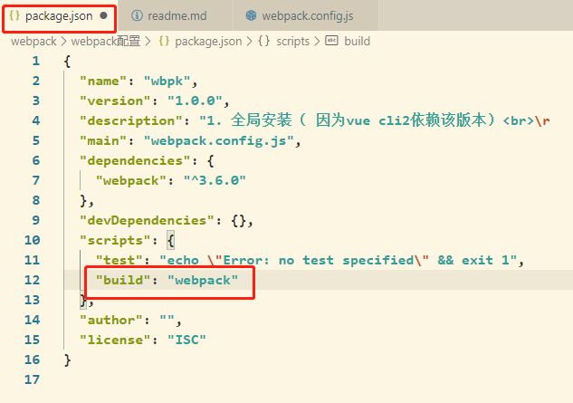

# webpack配置
## 安装和下载
1. 全局安装（ 因为vue cli2依赖该版本）<br>
     ``` npm install webpack@3.6.0 -g```
   
2. 局部安装(--save-dev是开发时依赖)<br>
   ` npm install webpack@3.6.0 --save-dev `
3. 为什么全局安装后，还需要局部安装呢？<br>
> 全局的指的是电脑上安装的webpack包, 所有项目都可以使用
本地webpack是指当前项目的webpack包. 通常全局webpack版本会比较高, 而我的项目是老项目, 使用的是老版本的
webpack打包的, 这时如果使用全局的webpack打包就会报错, 所以, 需要安装一个和项目匹配的本地的webpack包
## 文件目录
> webpack<br>
> |--dist<br>
> &emsp;&emsp;|--bundle.js(webpack可自动生成)<br>
> |--src<br>
> &emsp;&emsp;|--main.js<br>
> |--index.html<br>
> |--package.json
## webpack 的基本使用
### commonjs
> main.js<br>

```
function add(num1, num2) {
    return num1 + num2
}

function sub(num1, num2) {
    return num1 - num2
}

// 使用commonJs导出模块
module.exports={add, sub}
 ```
## webpack配置文件
**1. 如何使用webpack命令直接打包**<br>
> 刚刚我们打包的时候, 使用的是<br>
`webpack ./src/main.js ./dist/bundle.js`<br>
那么, 如果在项目下, 可不可以直接使用webpack, 而不用每次都指定文件呢? 这样可以方便很多
当然是可以的, 我们需要在项目根目录下创建一个文件: **webpack.config.js** *(这个名字是固定的)*

**2. webpack.config.js**
```
webpack.config.jsmodule.export={
  <!-- entry用来指定入口, 指定一个路径 -->
  entry: './src/main.js',
  <!-- output用来指定出口. 需要注意的是: 出口是一个对象, 由两部分组成: path和filename -->
  output: {
      path: '/dist',
      filename: '/bundle.js'
  }
}
```
**3.用webpack打包，发现出错**


webpack可以帮助我们获取当前项目的绝对路径.
我们` const path = require("path")`来获取相对目录. 可是当前目录下没有path的包, path是node下东西, 需要通过`npm init`来初始化,会生成package.json文件

**4.更新webpack.config.js**
```
const path = require("path");*****
module.export={
    entry: './src/main.js',
    output: {
        path: 'path.resovle(__dirname, "dist")',*****
        filename: '/bundle.js'
    }
}  
```
**5.构建项目**

npm run build构建项目



***
**tips**:
>1. markdown图片不显示

解：图片标题不要用中文